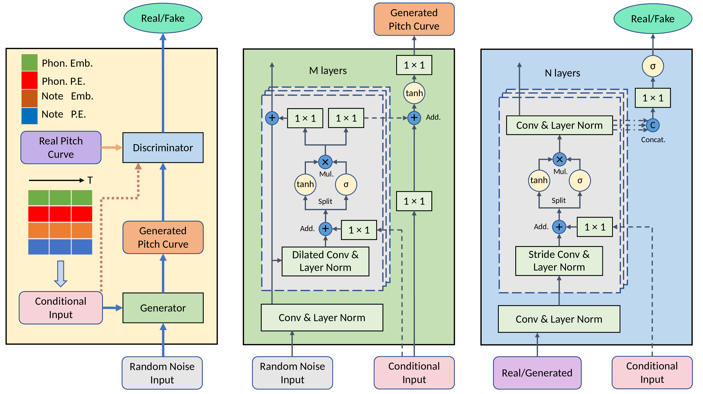

## PitchGAN: A Conditional GAN Generating Pitch Curve for Singing Voice Synthesis

### Abstract
Pitch curve prediction is an essential sub-task in singing voice synthesis, for the pitch curve conveys the singer's emotion and represents singing skills such as vibrato and portamento. Previous neural network approaches trained with mean squared error (MSE) loss have achieved outstanding performance on the objective metrics such as root-mean-square error (RMSE) and correlation coefficient (CORR), but hardly generate expressive vibratos and transitions due to the over-smoothing effect of MSE loss. In this paper, we propose PitchGAN, a WaveNet-based conditional generative adversarial network that predicts the pitch curve of the singing voice from a musical score. We inherit the dilated convolution units in WaveNet to obtain large receptive fields and turn the causal convolution into standard convolution to foresee succeeding frames. Additionally, a multi-scale discriminator is used to supervise the generator to study the subtle variations in pitch curves. We use the CNN-LSTM model trained with MSE loss as the baseline model and compare its performance with PitchGAN on objective metrics and subjective evaluation. Experiment results show that the proposed PitchGAN has competitive performance on the objective metrics and outperforms the baseline in subjective evaluation of naturalness and expressiveness.

### Architecture

### Sound Examples

The sound examples are from four models: the proposed PitchGAN; PitchGAN trained with the sum of GAN loss and MSE loss; generator in PitchGAN trained with MSE loss; the CNN-LSTM baseline model. The original audios from an amatuer singer are also listed here for reference.

|  SongID_start:end   | GAN(proposed) | GAN + MSE | Generator + MSE | CNN-LSTM + MSE  | Origin Audio |
|  :----:             | :----:        | :----:    | :----:          | :----:          | :----:       |
| 8765_21:51          | <audio src="test_set/8765_21_51/gan.mp3" controls></audio> | <audio src="test_set/8765_21_51/ganmse.mp3" controls></audio> | <audio src="test_set/8765_21_51/mse.mp3" controls></audio> | <audio src="test_set/8765_21_51/baseline.mp3" controls></audio> | <audio src="test_set/8765_21_51/origin.mp3" controls></audio> |
| 8765_101:132        | <audio src="test_set/8765_101_132/gan.mp3" controls></audio> | <audio src="test_set/8765_101_132/ganmse.mp3" controls></audio> | <audio src="test_set/8765_101_132/mse.mp3" controls></audio> | <audio src="test_set/8765_101_132/baseline.mp3" controls></audio> | <audio src="test_set/8765_101_132/origin.mp3" controls></audio> |
| 77374_49:75         | <audio src="test_set/77374_49_75/gan.mp3" controls></audio> | <audio src="test_set/77374_49_75/ganmse.mp3" controls></audio> | <audio src="test_set/77374_49_75/mse.mp3" controls></audio> | <audio src="test_set/77374_49_75/baseline.mp3" controls></audio> | <audio src="test_set/77374_49_75/origin.mp3" controls></audio> |
| 3198354_7:34        | <audio src="test_set/3198354_7_34/gan.mp3" controls></audio> | <audio src="test_set/3198354_7_34/ganmse.mp3" controls></audio> | <audio src="test_set/3198354_7_34/mse.mp3" controls></audio> | <audio src="test_set/3198354_7_34/baseline.mp3" controls></audio> | <audio src="test_set/3198354_7_34/origin.mp3" controls></audio> |
